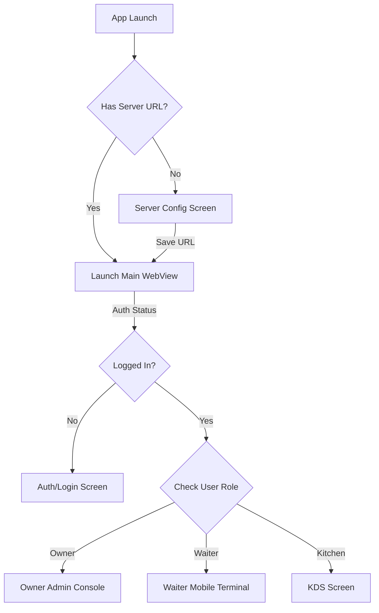

# Restuvexo Unified ROS Terminal App: Feature & Architecture Blueprint

This blueprint outlines the complete design, layout, and implementation details for the **Restuvexo Unified Mobile Application (v1)**. The app combines the roles of **Admin/Owner**, **Waiter Captain**, and **Kitchen Display (KDS)** into a single, high-fidelity shell.

---

## 1. Core Concept & Web-Native Hybrid Integration

The app uses a hybrid model: a native **Flutter container** wrapping a secure **high-performance WebEngine**. This provides several major advantages:

* **Instant Updates**: Any changes made to the POS, Waiter Dashboard, or KDS in the web code instantly appear in the app without requiring users to download a new APK.
* **Unified Codebase**: Logic, state syncs, and real-time WebSockets are maintained in a single place.
* **Persistent Sessions**: Login cookies and auth tokens are persisted locally in the WebEngine cache so staff members stay logged in even if the app is restarted.

---

## 2. User Journey & Screens Flow

### Screen A: Workspace Setup (Native Flutter)
* **Visuals**: Modern dark mode dashboard design with Restuvexo branding.
* **Purpose**: Allows first-time configuration of the target server address.
* **Fields**:
  * *Server Address Input*: Defaults to the production URL (`https://app.restuvexo.shop`).
  * *Local Connection Support*: Allows entering local host IPs (e.g., `http://192.168.0.100:3000`) for offline local servers.
* **Action**: Saves the URL inside `SharedPreferences` and launches the terminal workspace.

---

## 3. Role-Based Interfaces (Inside WebView Workspace)

Once connected, the workspace dynamically switches layout depending on the logged-in staff member's credentials:

### 1. Waiter Captain Terminal
* **Active Metrics**: Waiter's own active KOT counts and completed orders today.
* **Interactive Floor Map**: Visual grid representing tables, color-coded by occupancy status (Free = Green, Busy = Red).
* **Create Order Interface**: Quick menu category browsing, search, and cart manager. Waiter can select a table, add dishes, and dispatch KOT instantly.
* **Live KOT Queue**: Track preparation statuses (cooking, ready, served) in real-time.

### 2. Owner & Manager Console
* **Analytics**: Real-time sales graph, revenue metrics, expense tracker.
* **Administrative Controls**: Staff PIN reset management, restaurant settings, table layouts, menu additions.
* **POS Billing & Settle**: Cashier settlement desk with override discount and split payment features.

### 3. Kitchen Display (KDS)
* **Order Stream**: Real-time columns showing pending KOTs, items to cook, and cooking timers.
* **Action**: Swipe or tap to mark items as "Ready for Pickup", sending push notifications to waiters.

---

## 4. Premium Native Mobile Tweaks

To make the hybrid app feel like a native application, we implement:

1. **Cleartext Traffic Support**: Crucial for restaurant installations that run the server locally on a PC (`http://192.168.X.X`).
2. **Custom Back Navigation Interceptor**: Pressing the Android back button navigates backwards through web history (e.g., Cart → Menu) instead of exiting the application.
3. **Connection Status Fail-safes**: A custom native offline screen displays if the server goes down, featuring an instant "Retry" button.
